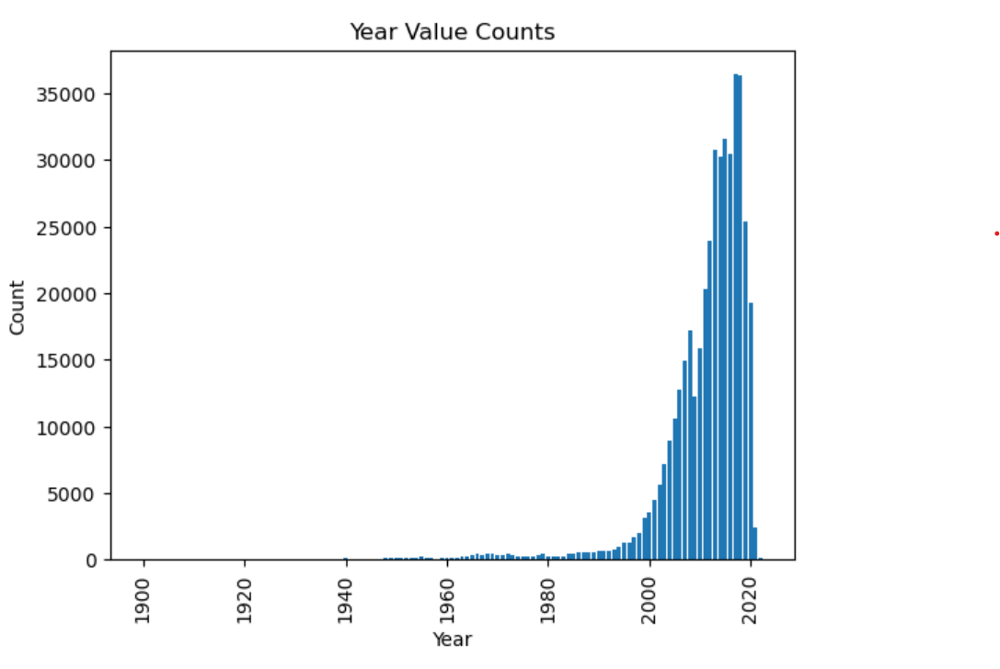
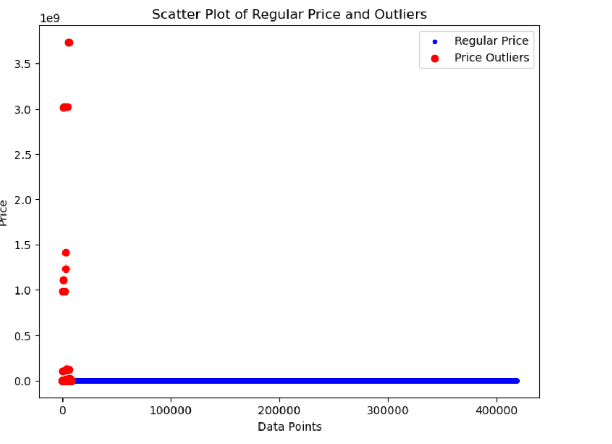

# MLAI_Module11 - Car Price Prediction using CRISP-DM

## Overview
This repository contains code and data for predicting car prices using the CRISP-DM (Cross-Industry Standard Process for Data Mining) framework. We aim to understand the factors that influence car prices and build a predictive model.

## Dataset
We are using a dataset from Kaggle containing information on 426K used cars. The dataset is a subset of an original dataset with 3 million cars. The goal is to ensure faster data processing while maintaining the key features.

## Business Understanding
From a business perspective, our objective is to provide valuable insights to a used car dealership. Specifically, we want to answer the following questions:
- What factors impact car prices the most?
- What features do consumers value in a used car?
- Can we build a predictive model to estimate car prices accurately?

## CRISP-DM Framework
The CRISP-DM framework guides our approach to solving this problem. Here are the steps involved:

### 1. Business Understanding
   - Define the business objectives.    
   - Convert business objectives into data problems.

### 2. Data Understanding
   - Explore the dataset.
     - Check for missing values
     - Check for unique values
     - Check for quotes, commnas and other special characters
     - Identify outliers
   - Identify potential predictors.
   - Understand data quality and completeness.
     - Explore the data visually for various features. Samples are shared below. 
     
     - Outliers for numeric columns - Price, odometer
     
     

### 3. Data Preparation
   - Dropping the rows where requied columns like Price, Odometer are NaN
   - Dropping the duplicate data
   - Remove the outliers for Price, Odometer
   - Handle missing data with NA for all the object columns
   - Dropping the columns which are not required.
   - Encode categorical variables.
   - Normalize or scale features.
   - Create additional features if needed.

### 4. Modeling
   - Finding the highly coorelated features and using them for modeling
   - Split the data into training and testing sets.
   - Build and evaluate predictive models using LinearRegression, LinearRegression with PCA, LinearRegression with PolynomialFeatures.
   - Experiment with different algorithms and techniques like GridSearchCV.
   
### 5. Evaluation
   - Assess model performance using appropriate metrics using the MeanSquaredError using the Cross validation methods.
   - Fine-tune the model if necessary.
   - Interpret the model's predictions and insights.

### 6. Deployment
   - Deploy the model in a production environment if applicable.
   - Provide recommendations to the used car dealership based on the model's insights.

## Summary of Regression Model Evaluations

### Default Linear Regression Model
    - Y Test Mean Squared Error: 85554108.73343366
    - Y Train Mean Squared Error: 86155304.63753816
    - R-squared (Coefficient of Determination): 0.23192333669582754  

### Default Linear Regression Model with PCA
    - Y Test Mean Squared Error: 94843726.96636324
    - Y Train Mean Squared Error: 95212987.96033375
    - R-squared (Coefficient of Determination): 0.14852419805305872
  
### Default Linear Regression Model with Polynomial features
    - Y Test Mean Squared Error: 71762733.32594372
    - Y Train Mean Squared Error:  72417025.11379156
    - R-squared (Coefficient of Determination): 0.3557377713522022

## Next Steps
   - Expand dataset with more examples if certain vehicle segments are not considered.
   - Incorporate temporal effects like month/year sold to account for market fluctuations.
   - Set up pipeline for retraining model periodically on new sales data.

## Usage
- Clone this repository to your local machine.
- Run the  [Jupyter Notebook](https://github.com/jainipallavi102210/MLAI_Module11/blob/main/carprediction.ipynb) to follow the data analysis and modeling process.

## Results
We will document our findings, including key predictors of car prices and the performance of our predictive models, in the [Jupyter Notebook](https://github.com/jainipallavi102210/MLAI_Module11/blob/main/carprediction.ipynb) itself.

## Conclusion
By following the CRISP-DM framework, we aim to provide actionable insights to our client, helping them understand consumer preferences and make informed decisions regarding used car pricing.

